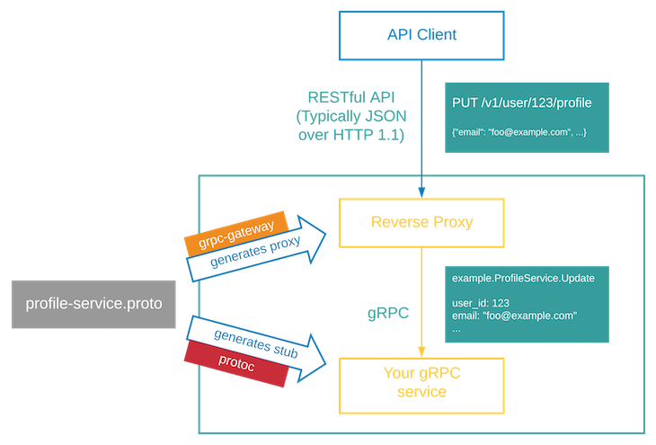

# golang-grpc-gateway-demo
Source code demo of article: https://tuts.heomi.net/an-all-in-one-guide-to-grpc-gateway/

# Introduction

gRPC-Gateway is a plugin for `protoc` and will generate Go code from the gRPC definition.

Take a look at this flow chart to get an understanding of how a gRPC gateway works.

