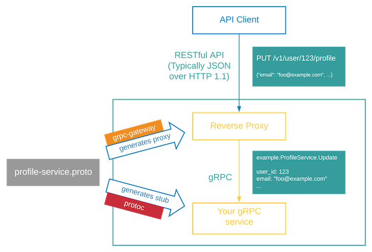
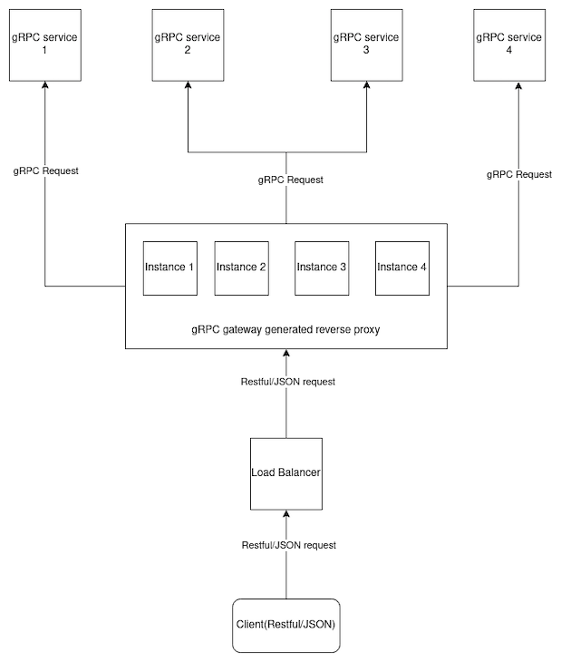

# An all-in-one guide to gRPC-Gateway
* https://tuts.heomi.net/an-all-in-one-guide-to-grpc-gateway/

# Introduction

gRPC-Gateway is a plugin for `protoc` and will generate Go code from the gRPC definition.

Take a look at this flow chart to get an understanding of how a gRPC gateway works.




# Why gRPC-Gateway?

gRPC gateways build a proxy for a gRPC service that acts as a Restful/JSON application to the client.

The most common gRPC-Gateway pattern is to create a single gRPC gateway server (which might be running on multiple machines) that interfaces with multiple gRPC services as a proxy for clients.




# Setting up gRPC-Gateway

gRPC-Gateway is a plugin for `protoc`. Before using it, the protocol buffer compiler must be installed on the system. Follow this guide on [offical gRPC website](https://grpc.io/docs/protoc-installation/) to install protoc on your system according to the operating system you are using.

Linux, using `apt` or `apt-get`, for example:
```bash
$ sudo apt install -y protobuf-compiler
$ protoc --version  # Ensure compiler version is 3+

libprotoc 3.12.4
```

gRPC-Gateway uses and generates Go code. To install Go, follow the guide on the [official website](https://go.dev/doc/install). Once you have installed Go on your system, you are all set to install the gRPC-Gateway plugin. Here we are using goenv to manage the Go versions
```bash
$ goenv versions
  system
  1.17.13
  1.18.10
  1.18.3
  1.19.13
  1.20.14
  1.21.11
* 1.22.4 (set by /home/tvt/.goenv/version)
```

For building protocol buffers and generating a gRPC gateway reverse proxy, `Buf` will be used. You can install `Buf` by following the guide on the [official website](https://docs.buf.build/installation) or [official repository](https://github.com/bufbuild/buf).

On Linux, First install the Homebrew (https://brew.sh/) or follow the guide [Install Brew on Ubuntu 24.04 or 22.04 LTS Jammy Linux] (https://linux.how2shout.com/install-brew-on-ubuntu-22-04-lts-jammy-linux/)

```bash
$ /bin/bash -c "$(curl -fsSL https://raw.githubusercontent.com/Homebrew/install/HEAD/install.sh)"


Warning: /home/linuxbrew/.linuxbrew/bin is not in your PATH.
  Instructions on how to configure your shell for Homebrew
  can be found in the 'Next steps' section below.
==> Installation successful!


==> Next steps:
- Run these two commands in your terminal to add Homebrew to your PATH:
    (echo; echo 'eval "$(/home/linuxbrew/.linuxbrew/bin/brew shellenv)"') >> /home/tvt/.bashrc
    eval "$(/home/linuxbrew/.linuxbrew/bin/brew shellenv)"
- Install Homebrew's dependencies if you have sudo access:
    sudo apt-get install build-essential
  For more information, see:
    https://docs.brew.sh/Homebrew-on-Linux
- We recommend that you install GCC:
    brew install gcc
- Run brew help to get started
- Further documentation:
    https://docs.brew.sh
```

To run the brew commands regardless of our directory, add the folder where Homebrew has been installed to your system’s environment path.
```bash
$ (echo; echo 'eval "$(/home/linuxbrew/.linuxbrew/bin/brew shellenv)"')
$ eval "$(/home/linuxbrew/.linuxbrew/bin/brew shellenv)"
$ sudo apt-get install build-essential
$ brew install gcc
```

Confirm Linux Brew is working fine
```bash
$ brew doctor
$ brew -v
Homebrew 4.3.21
```


You can install buf on macOS or Linux using Homebrew:
```bash
$ brew install bufbuild/buf/buf
```

This installs:

* The binaries `buf`, `protoc-gen-buf-breaking`, `protoc-gen-buf-lint`.
* Bash completion for `buf`.
* Fish completion for `buf`.
* Zsh completion for `buf`.


After installed the Buf CLI, check the version and update if necessary:
```bash
$ buf --version
1.41.0
```

# Project structure

Create a directory named `golang-grpc-gateway-demo`, which will hold the gRPC-Gateway project.

All the Protocol Buffers files will be in the `proto` directory, while Go files will be in `root`. For setting up the Go project, use `go mod init golang-grpc-gateway-demo` and create a `main.go` file. Your project should look like this:
```bash
├── main.go
├── go.mod
└── proto
```

# Configuring Buf

Buf requires three different files to generate stubs and reverse proxies.

```bash
├── buf.gen.yaml
├── buf.work.yaml
├── go.mod
├── main.go
└── proto
    ├── buf.yaml
```

The file `buf.gen.yaml`:
```yaml
version: v1
plugins:
  # generate go structs for protocol buffer defination
  - remote: buf.build/library/plugins/go:v1.27.1-1
    out: gen/go
    opt:
      - paths=source_relative
  # generate gRPC stubs in golang
  - remote: buf.build/library/plugins/go-grpc:v1.1.0-2
    out: gen/go
    opt:
      - paths=source_relative
  # generate reverse proxy from protocol definations
  - remote: buf.build/grpc-ecosystem/plugins/grpc-gateway:v2.6.0-1
    out: gen/go
    opt:
      - paths=source_relative
  # generate openapi documentation for api
  - remote: buf.build/grpc-ecosystem/plugins/openapiv2:v2.6.0-1
    out: gen/openapiv2
```

The file `buf.yaml`:
```yaml
 version: v1
 deps:
 # adding well known types by google
  - buf.build/googleapis/googleapis
```

The file `buf.work.yaml`:
```yaml
version: v1
directories:
  - proto
```

You can test your configuration by running the `buf build` command in your project root.


# Using gRPC-Gateway

Until now, you have set up gRPC-Gateway as a plugin, but now the question arises of how to define basic API specifications like HTTP method, URL, or request body.

For defining what these specification options are using in Protocol Buffers’ definition of an rpc method on a service, the following example will make it more clear.

**proto/hello/hello_world.proto**
```proto
// define syntax used in proto file
syntax = "proto3";
// options used by gRPC golang plugin(not related to gRPC gateway)
option go_package = "github.com/favtuts/golang-grpc-gateway-demo;grpc_gateway_demo";

// well know type by google, gRPC gateway uses HTTP annotation.
import "google/api/annotations.proto";

package hello_world;

// simple message
message HelloRequest {
  string name = 1;
}

message HelloReply {
  string message = 1;
}

// a gRPC service
service Greeter {
 // SayHello is a rpc call and a option is defined for it
  rpc SayHello (HelloRequest) returns (HelloReply) {
  // option type is http
    option (google.api.http) = {
    // this is url, for RESTfull/JSON api and method
    // this line means when a HTTP post request comes with "/v1/sayHello" call this rpc method over this service
      post: "/v1/sayHello"
      body: "*"
    };
  }
}
```

The `option` keyword is used to add specifications for the Rest request. The `option` method is chosen and the path for that request is specified.

In above example, `post` is the HTTP method for request and `/v1/sayHello` is the response.

You can now build your code using the `buf generate` command in the root of your project directory.

After the command completes, there should be a `gen` directory in the root of your project with Go code inside. These files contain stubs for gRPC and the gRPC gateway reverse proxy. `openapiv2` contains the open API documentation for Swagger UI.

```bash
gen
|-- go
|   `-- hello
|       |-- hello_world.pb.go
|       |-- hello_world.pb.gw.go
|       `-- hello_world_grpc.pb.go
`-- openapiv2
    `-- hello
        `-- hello_world.swagger.json
```